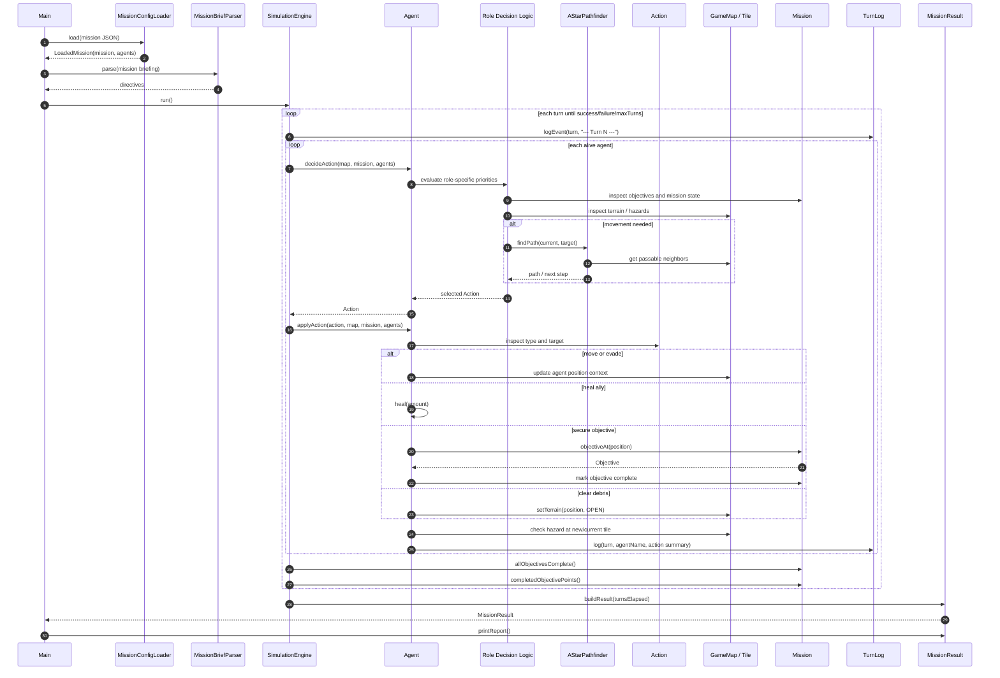

## Class Diagram

This diagram highlights the major object relationships:

- Agent inheritance
- Engine coordination
- Mission/domain interactions
- Map composition
- Pathfinding dependency
- Configuration and NLP support

```mermaid
classDiagram
    direction LR

    class Main {
        +main(String[] args) void
    }

    class SimulationEngine {
        -Mission mission
        -List~Agent~ agents
        -TurnLog log
        -boolean verbose
        +run() MissionResult
        -buildResult(int turnsElapsed) MissionResult
    }

    class TurnLog {
        -List~String~ entries
        +log(int turn, String agentName, String action) void
        +logEvent(int turn, String event) void
        +getEntries() List~String~
    }

    class Agent {
        <<abstract>>
        #String name
        #AgentRole role
        #Position position
        #int health
        #int maxHealth
        #boolean alive
        #int priority
        +decideAction(GameMap map, Mission mission, List~Agent~ agents)* Action
        +applyAction(Action action, GameMap map, Mission mission, List~Agent~ agents) void
        +takeDamage(int damage) void
        +heal(int amount) void
        +isLowHealth() boolean
        #stepToward(Position destination, GameMap map) Position
        #nearestObjective(Mission mission) Objective
        #nearestInjured(List~Agent~ agents) Agent
    }

    class Scout {
        +decideAction(GameMap map, Mission mission, List~Agent~ agents) Action
    }

    class Medic {
        +decideAction(GameMap map, Mission mission, List~Agent~ agents) Action
    }

    class Engineer {
        +decideAction(GameMap map, Mission mission, List~Agent~ agents) Action
    }

    class AgentRole {
        <<enumeration>>
        MEDIC
        SCOUT
        ENGINEER
    }

    class Action {
        -Type type
        -Position target
        -String reason
        +getType() Type
        +getTarget() Position
        +getReason() String
    }

    class ActionType {
        <<enumeration>>
        MOVE
        HEAL
        SECURE_OBJECTIVE
        CLEAR_DEBRIS
        WAIT
        EVADE
    }

    class Mission {
        -String name
        -String briefing
        -int maxTurns
        -GameMap map
        -List~Objective~ objectives
        -List~Hazard~ hazards
        +objectiveAt(Position p) Objective
        +allObjectivesComplete() boolean
        +completedObjectivePoints() int
        +totalObjectivePoints() int
    }

    class Objective {
        -String name
        -Position position
        -int missionPoints
        -boolean complete
        +complete() void
        +isComplete() boolean
    }

    class Hazard {
        -String name
        -Position position
        -HazardType type
        -int damagePerTurn
    }

    class MissionResult {
        -Outcome outcome
        -int turnsElapsed
        -int pointsScored
        -int totalPoints
        -List~Agent~ survivors
        -List~String~ log
        +printReport() void
    }

    class MissionOutcome {
        <<enumeration>>
        SUCCESS
        PARTIAL
        FAILURE
    }

    class GameMap {
        -int width
        -int height
        -Tile[][] tiles
        +inBounds(Position p) boolean
        +getTile(Position p) Tile
        +setTerrain(Position p, Terrain t) void
        +getPassableNeighbors(Position p) List~Position~
        +print(List~Position~ agentPositions) void
    }

    class Tile {
        -Terrain terrain
        -boolean hasObjective
        -boolean hasHazard
        -boolean objectiveComplete
        +toChar() char
    }

    class Terrain {
        <<enumeration>>
        OPEN
        DEBRIS
        WATER
        WALL
        HAZARD
        +isPassable() boolean
    }

    class Position {
        +int x
        +int y
        +manhattanDistance(Position other) int
        +neighbors() List~Position~
    }

    class AStarPathfinder {
        -GameMap map
        +findPath(Position start, Position goal) List~Position~
        -reconstructPath(Map cameFrom, Position goal) List~Position~
    }

    class MissionConfigLoader {
        +load(InputStream json) LoadedMission
    }

    class LoadedMission {
        <<record>>
        +Mission mission
        +List~Agent~ agents
    }

    class MissionBriefParser {
        +parse(String briefing) List~Directive~
        +printDirectives(List~Directive~ directives) void
    }

    class Directive {
        <<record>>
        +String role
        +String verb
        +String target
    }

    Agent <|-- Scout
    Agent <|-- Medic
    Agent <|-- Engineer
    Agent --> AgentRole
    Agent --> Action : produces
    Action --> ActionType
    Action --> Position
    Agent --> Position : has current location
    Agent ..> GameMap : reads terrain
    Agent ..> Mission : evaluates objectives
    Agent ..> AStarPathfinder : uses pathfinding

    SimulationEngine --> Mission : coordinates
    SimulationEngine --> Agent : runs turns for
    SimulationEngine *-- TurnLog : records events
    SimulationEngine --> MissionResult : produces

    Mission *-- Objective : contains
    Mission *-- Hazard : contains
    Mission --> GameMap : uses
    MissionResult --> MissionOutcome
    MissionResult --> Agent : reports survivors

    GameMap *-- Tile : contains
    Tile --> Terrain
    Tile --> Position
    AStarPathfinder --> GameMap
    AStarPathfinder --> Position

    MissionConfigLoader --> LoadedMission : creates
    LoadedMission --> Mission
    LoadedMission --> Agent
    MissionBriefParser --> Directive : extracts
    Main --> MissionConfigLoader
    Main --> MissionBriefParser
    Main --> SimulationEngine
```

## Simulation Turn Sequence Diagram

This diagram shows the main runtime workflow for a single simulation turn.

## Design Notes

### Agent Inheritance

`Agent` is an abstract base class. It owns shared state and helper behavior, while subclasses implement role-specific decision logic through `decideAction(...)`.

### Engine Relationships

`SimulationEngine` coordinates the mission, agents, and logs, but does not hardcode the strategy for each agent. This keeps the engine reusable and allows new agent roles to be added later.

### Mission Interactions

Agents interact with the `Mission` object to evaluate objectives and mission progress. They interact with `GameMap` to reason about movement, hazards, terrain, and passable tiles.

### Action Execution

Agents return `Action` objects that describe what they intend to do. The action is then applied to the current simulation state, which may update agent position, objective completion, terrain, health, or logs.
